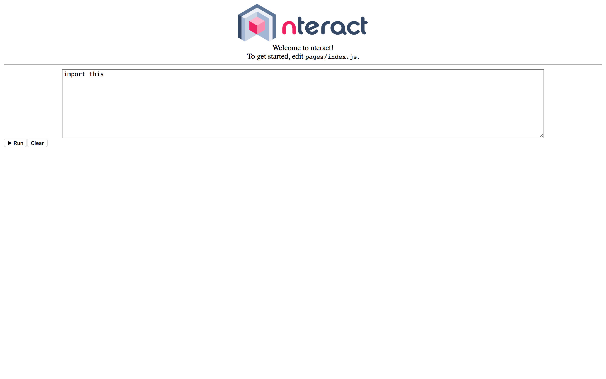

# create-nteract-app

## hacking
Install `create-nteract-app` globally

```bash
git clone https://github.com/alexandercbooth/create-nteract-app.git
cd create-nteract-app
npm i -g
```

Create an nteract app in another terminal and run the development server.
```bash
create-nteract-app yourApp
cd yourApp
yarn dev
```

Now, navigate to [here](http://localhost:3000/) and you should see the following:

